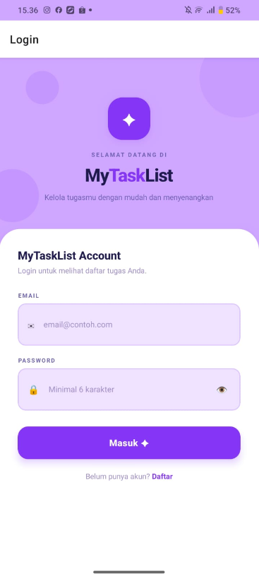
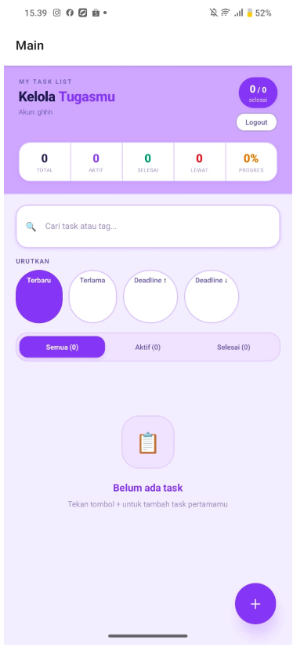
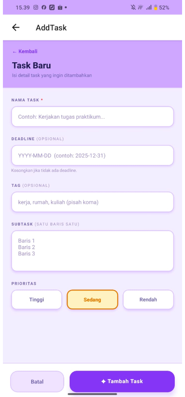

# MyTaskList 📋

**Nama:** Yona Lidya Matondang  
**NIM:** 243303621249  
**Mata Kuliah:** Pemrograman Mobile  

---

## 📖 Deskripsi Aplikasi

MyTaskList merupakan aplikasi manajemen tugas berbasis React Native yang dirancang untuk membantu pengguna dalam mengelola aktivitas harian secara lebih terorganisir. Aplikasi ini dilengkapi dengan sistem autentikasi sehingga setiap pengguna memiliki akun pribadi dengan data tugas yang tersimpan secara terpisah di dalam perangkat.

Melalui aplikasi ini, pengguna dapat menambahkan, mengedit, dan menghapus tugas, serta mengatur berbagai atribut seperti tingkat prioritas, batas waktu (deadline), tag, dan subtask. Dengan fitur-fitur tersebut, MyTaskList diharapkan dapat meningkatkan produktivitas serta mempermudah pengelolaan pekerjaan sehari-hari.

---

## ✅ Fitur yang Diimplementasikan

- [x] Autentikasi pengguna (Register & Login)  
- [x] Tambah, edit, dan hapus task  
- [x] Pengaturan prioritas task (Tinggi / Sedang / Rendah)  
- [x] Deadline task dengan date picker  
- [x] Subtask (checklist di dalam task)  
- [x] Tag / label pada task  
- [x] Pin task penting ke atas daftar  
- [x] Filter task (Semua / Aktif / Selesai)  
- [x] Pencarian task berdasarkan judul dan tag  
- [x] Urutkan task (Terbaru, Terlama, Deadline, Prioritas)  
- [x] Indikator task yang melewati deadline (overdue)  
- [x] Statistik ringkasan (Total, Aktif, Selesai, Lewat, Progres)  
- [x] Progress bar penyelesaian task  
- [x] Penyimpanan data lokal menggunakan AsyncStorage  
- [x] Tampilan dark mode  

---

## 📸 Screenshot

> **Catatan:** Screenshot diambil dari perangkat menggunakan Expo Go.

| Login | Main | Add Task |
|-------|------------|-------------|
|  |  |  |

---

## 🚀 Cara Menjalankan Project

### Prasyarat
- Node.js (versi 18 atau lebih baru)
- Expo CLI
- Aplikasi **Expo Go** di HP (tersedia di Play Store / App Store)

### Langkah-langkah

1. **Clone atau ekstrak project**
   ```bash
   cd mytasklist
   ```

2. **Install dependencies**
   ```bash
   npm install
   ```

3. **Jalankan project**
   ```bash
   npx expo start
   ```

4. **Buka di HP**  
   Scan QR code yang muncul di terminal menggunakan aplikasi **Expo Go**

### Atau lihat online di Snack.dev

🔗 [Buka di Snack.dev](https://snack.expo.dev/@yonalidya/my-task-list)

---
